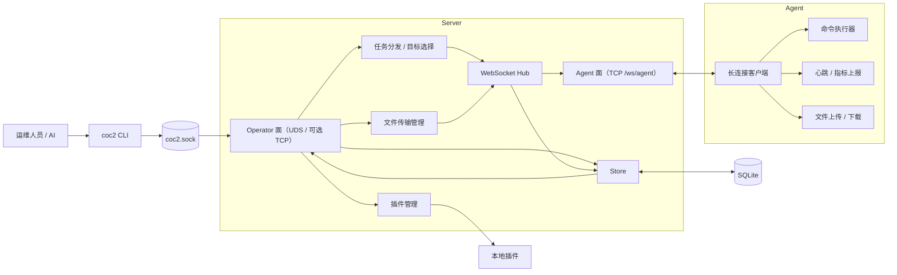

# CoC2

面向合法运维场景的轻量服务器批量管理系统：一个 Server、N 台 Agent、一个为 AI 而生的 CLI。

- **AI-native 操控面** —— 没有 Dashboard。一切操作走 `coc2` CLI：stdout 纯 JSON、稳定退出码、`coc2 schema` 自描述，LLM Agent 拿起来就能用（[契约全文](docs/ai-usage.md)）。
- **零信任边界清晰** —— Agent 拨出长连接（被控机不需要开任何入站端口）；Operator 面默认 Unix socket，文件权限即访问边界。
- **小** —— 纯 Go，三个静态二进制，SQLite 单文件持久化，无外部依赖服务。

> 本项目是运维工具：能力（任意命令下发、文件分发、静默长连接）与 C2 框架同构，用于合法的基础设施管理。使用前确保你对目标机器有管理授权，遵守所在地法律。

## 30 秒上手

```bash
make build                                    # 产出 bin/{server,agent,coc2}

# token 必须换掉：内置的 coc2-dev-token 是公开值，Server 会拒绝用它启动。
export COC2_TOKEN=$(openssl rand -hex 32)

./bin/server -config ./config.yaml -token "$COC2_TOKEN"          # Agent 面 :8080；Operator 面 ./coc2.sock
./bin/agent -server ws://127.0.0.1:8080/ws/agent -token "$COC2_TOKEN" &

./bin/coc2 run --cmd "uptime" --agents <agent_id> --wait
```

只想本地随手跑一次、不想配 token：加 `-allow-dev-token` 显式放行（不要用于任何真实环境）。

输出即结果：

```json
{"all_ok":true,"results":[{"task_id":"…","agent_id":"…","state":"success","exit_code":0,"stdout":" 9:03  up 14 days …","stderr":"","duration_ms":12}]}
```

## 能力总览

**命令执行**
- 单机 / 批量下发，目标可用 `agent_ids` / `group_ids` / `tags` 三种选择器混选
- 至多一次的派发语义 + 服务端超时回收，任务不会静默卡死（[语义细节](#任务执行语义)）
- 取消 / 超时终止整棵进程树，不留孤儿进程
- Agent 离线时任务排队，重连自动补发

**文件传输**
- 上传 / 下载，分块 + SHA256 校验 + `Seq` 乱序重排与缺包检测
- 断点续传：失败保留 `.part`，重试自动续传；10 分钟无进展自动回收
- 全程审计（谁、何时、传到哪、完整性是否验证）
- 传输可取消：`coc2 transfers cancel <id> [--wait]`；两端停泵、`.part` 保留可续传；取消意图（`cancel_requested`）与终态（`canceled`）都写审计，agent 失联时 30s 宽限期后服务端单方面落终态

**连接与协议**
- Agent 主动拨出 WebSocket，指数退避重连；心跳维护在线状态
- 线协议 Protobuf 二进制帧（[wire.proto](proto/coc2/v1/wire.proto) 是单一事实源），与旧 JSON 帧按 hello 协商共存，老 Agent 不掉线
- TLS 1.3 / mTLS 可选，跨站 WebSocket 握手全拒

**平台**
- SQLite 持久化（Agent、任务、分组、指标、传输审计、操作日志）
- 操作审计（`oplog`）：每条写操作记录谁（UDS 内核凭据 uid→用户名 / TCP token 身份）、从哪（peer pid / socket / IP）、做了什么、结果如何；认证失败同样落库。Agent 面不只记失败——已认证 agent 的连接、任务结果、传输终态也各落一行（含结果是否被采纳），所以"真 agent 干的"和"伪造的"事后可区分；`coc2 audit list` 查询
- 基础监控上报 + 指标历史（每 Agent 最近 1000 条）
- 运行日志可落盘并按大小轮转（`log_file` / `log_level` / `log_max_*`，默认 stderr）；审计历史保留可配（`audit_retention_days`，默认 **14 天**，设为 `0` 则永久保留）
- 本地可执行文件插件钩子（[plugins/README.md](plugins/README.md)）
- CLI：紧凑 JSON / 退出码契约 / 无交互 / `--wait` 阻塞收结果 / `schema` 自描述

## 架构



两个监听面，各守各的边界：

| 平面 | 端点 | 谁在用 | 鉴权 |
|---|---|---|---|
| Agent 面 | `-listen`（默认 `:8080`）的 `/ws/agent` + `/healthz` | 被控机上的 Agent | 协议内 hello token（恒定时间比较） |
| Operator 面 | 默认 Unix socket `./coc2.sock`（`0600`）；`-operator-listen` 可额外挂 TCP | CLI / 脚本 / AI | socket 免 token（文件权限即边界）；TCP 上强制 token |

被控机只需能**出站**访问 Server；运维流量默认不出本机文件系统。

## 构建

要求 Go 1.27+。所有日常动作收口在 `make`（`make help` 看全部目标）：

```bash
make build       # 三个二进制 → bin/server, bin/agent, bin/coc2
make check       # 提交前一条龙：gofmt 校验 + go vet + go test ./...
make test-race   # go test -race ./...
make proto       # 改 proto/ 后重新生成线协议码（需 protoc + protoc-gen-go）
make clean       # 清 ./bin 与仓库根 socket/db，不动缓存与源码
```

Go 缓存默认落在仓库本地 `.gocache_local/`、`.gomodcache_local/`，可环境覆盖（`GOCACHE=/tmp/x make build`）。生成码 `internal/protocol/pb/` 提交进仓库，构建不需要 protoc。不想用 make 的等价命令：`go build -o ./bin/server ./cmd/server`（agent/cli 同理）、`go test ./...`。

## 运行

### Server

```bash
./bin/server -config ./config.yaml          # 命令行参数覆盖 yaml 同名字段
```

| 参数 | yaml 键 | 默认 | 说明 |
|---|---|---|---|
| `-config` | — | `config.yaml` | 配置文件路径 |
| `-listen` | `listen` | `:8080` | Agent 面地址 |
| `-operator-uds` | `operator_uds` | `./coc2.sock` | Operator 面 socket（空值需配合 `-operator-listen`） |
| `-operator-listen` | `operator_listen` | 空 | Operator 面 TCP 逃生门（启用即强制 token） |
| `-token` | `token` | — | Agent hello 共享 token（生产必换，`openssl rand -hex 32`）；仍为内置开发值时拒绝启动 |
| `-api-token` | `api_token` | 同 `-token` | Operator 面 TCP 的 token |
| `-allow-dev-token` | `allow_dev_token` | `false` | 允许用内置开发 token 启动（仅限本地一次性运行） |
| `-db` | `db` | `coc2.db` | SQLite 路径 |
| `-plugins` | `plugins` | `plugins` | 插件目录 |
| `-tls-cert` / `-tls-key` | `tls_cert` / `tls_key` | 空 | 启用 TLS 1.3 |
| `-client-ca` | `client_ca` | 空 | 开启 mTLS |
| `-require-tls` | `require_tls` | `false` | 无 TLS 配置时拒绝启动 |
| `-write-wait` / `-pong-wait` / `-ping-period` | 同名 | `10s/70s/25s` | WebSocket 保活参数 |

### Agent

```bash
./bin/agent -server ws://127.0.0.1:8080/ws/agent -token <token> -tags web,prod
```

| 参数 | 默认 | 说明 |
|---|---|---|
| `-server` | `ws://127.0.0.1:8080/ws/agent` | Server 地址（生产用 `wss://`） |
| `-token` | — | 与 Server `token` 一致 |
| `-agent-id` | 主机名（取不到则随机） | 建议显式指定，稳定身份 |
| `-tags` | 空 | 逗号分隔，供 `--tag` 选择器命中 |
| `-heartbeat` / `-max-backoff` | `30s/30s` | 心跳间隔 / 重连退避上限 |
| `-server-name` / `-ca-cert` / `-client-cert` / `-client-key` | 空 | TLS / mTLS 客户端参数 |

## CLI（人类与 AI 共用）

```bash
./bin/coc2 health                          # 连通性自检
./bin/coc2 agents list --online            # 在线清单
./bin/coc2 run --cmd "df -h" --agents web1 --wait
./bin/coc2 run --cmd "yum -y update" --tag env=prod --yes --wait
./bin/coc2 run --cmd "tar czf /backup.tgz /srv" --agents web1 --priority 10 --wait
./bin/coc2 push --agent web1 --local ./app.bin --remote /opt/app.bin --wait
./bin/coc2 pull --agent web1 --remote /var/log/app.log --local ./app.log --wait
./bin/coc2 tasks cancel <task_id>
./bin/coc2 groups create --name ops --agents a1,a2
./bin/coc2 schema                          # 机器可读命令全表
```

完整命令面（`schema` 里逐条有 flag 类型与默认值）：`health` · `agents list|get|metrics|history` · `groups list|get|create|add|remove` · `run` · `tasks list|get|cancel` · `metrics overview` · `transfers list|get` · `plugins list` · `push` · `pull` · `schema` · `help`。

**输出契约**——为程序化调用设计：

- stdout 只有一个紧凑 JSON 文档（`--pretty` 换缩进）；错误 JSON 走 stderr，日志永不混进结果
- 退出码稳定：`0` 成功 · `1` 服务端/任务/传输失败或等待超时 · `2` 连不上 · `3` 鉴权失败 · `4` 用法错误
- 零交互：无提示、无确认等待、无进度条；危险面（多目标 fan-out）靠 `--yes` 显式声明
- 全局 flag（`-server` `-token` `--pretty` `-timeout` `-insecure`）可站在命令行任意位置
- 目标解析：`-server` / `COC2_SERVER` 给路径走 socket，给 `http(s)://` 走 TCP；token 走 `COC2_TOKEN`
- 三个超时别混：`--exec-timeout`（任务执行秒数）· 全局 `-timeout`（HTTP 请求时长）· `--wait-timeout`（CLI 轮询预算）

### AI 集成

接入三步：跑一次 `coc2 schema` 学命令面 → 按退出码 + `results[]` 分支 → 参照 [docs/ai-usage.md](docs/ai-usage.md)（工作流模板、陷阱清单、聚合输出格式）。验收方式就是它自己：一个只拿到 schema 输出、没读过任何源码的 LLM Agent，独立完成了 7 步巡检→下发→建组→统计的运维闭环。

### 裸 API

CLI 之下是普通 HTTP JSON（手工调试用）。空列表返回 `[]` 不返回 `null`：

```bash
curl --unix-socket ./coc2.sock http://unix/api/v1/agents
curl -H "Authorization: Bearer $TOKEN" http://127.0.0.1:8081/api/v1/tasks   # operator-listen 模式
```

| 方法 | 路径 | 说明 |
|---|---|---|
| GET | `/healthz` | 存活探针（两面各一份，响应带 `plane`） |
| GET | `/api/v1/agents` · `/api/v1/agents/:id/metrics` · `…/metrics/history` | Agent 与指标 |
| GET/POST | `/api/v1/groups` · `/api/v1/groups/:id` | 分组（POST 全量替换语义） |
| GET/POST | `/api/v1/tasks` · `/api/v1/tasks/batch` · `/:id` · `/:id/cancel` | 任务 |
| POST | `/api/v1/files/upload` · `/api/v1/files/download` | 传输（`--local` 是 Server 侧路径） |
| GET | `/api/v1/transfers` · `/:id` · `/api/v1/plugins` · `/api/v1/metrics/overview` | 只读 |
| GET | `/ws/agent` | Agent 长连接（仅 Agent 面） |

## 线协议

`proto/coc2/v1/wire.proto` 是单一事实源，生成码入库。帧自描述：WebSocket text 帧 = 旧 JSON 信封，binary 帧 = protobuf `WireEnvelope`；Agent 在 hello 里声明 `proto_version`，Server 决定升档与否，混跑兼容。二进制帧下文件 chunk 走裸 bytes（JSON 路径的 base64 膨胀 -33%），且 `stdout`/`stderr`/`command` 为 bytes 字段——非 UTF-8 输出不再被静默损坏。改 `.proto` 后 `make proto` 重生成并保证对拍测试绿。

## 安全

- **双平面隔离**：Agent 面只有 WS 升级与探针；全部管理 API 只在 Operator 面。
- **默认 socket 边界**：Operator 面 `0600` Unix socket，token 不落配置文件；TCP 逃生门一旦启用，每请求强制恒定时间比较的 token（Bearer / Basic 两式）。
- **Agent 面鉴权是连接级的**：hello 通过之前，除 `hello` 本身外任何消息都被拒绝并立即断开——未认证连接无法写入任务结果、指标或传输数据。每条已认证消息以连接身份为准（报文里自称的 `agent_id` 会被覆盖），任务结果只能落到该 agent 自己的任务上。
- **默认 token 拒绝启动**：`coc2-dev-token` 是公开值，Server 见到它直接拒绝启动，除非显式 `-allow-dev-token`。
- **无浏览器即拒浏览器**：携带任何 `Origin`（含 `null`）的 WS 握手一律拒绝。
- **传输完整性**：分块 `Seq` 重排 + 缺包/重复检测 + SHA256 兜底。
- **生产请 TLS**：Server 配 `tls_cert`/`tls_key`（可选 `client_ca` 开 mTLS），Agent 走 `wss://` + 证书参数；`-require-tls` 可硬约束。未启用 TLS 时两端都会打警告。

## 任务执行语义

- **至多一次派发**：任务成功发送给 Agent 即标 `dispatched`，不等 `task_ack`——ack 丢失不会导致重连后重复执行。
- **结果只认归属**：结果写入要求任务仍是非终态、且属于上报的连接身份；终态一旦落库不会被迟到或伪造的结果改写，被拒绝的结果仍记审计（`ok=false`）。
- **回收器兜底**：`dispatched`/`cancel_requested` 超 `timeout_secs + 30s` 无结果，Server 标记 `timeout`/`canceled`。
- **进程组隔离**：Agent 以独立进程组执行，取消/超时终止整棵进程树。
- **并发上限**：Agent 同时最多跑 16 个任务；超出的派发立刻以 `failed` 结果回绝，而不是静默丢弃。
- 终态枚举：`success | failed | timeout | canceled`。

## 插件

Server 加载 `-plugins` 目录下可执行文件，事件 JSON 从 stdin 传入，钩子：`agent_connected` · `task_result` · `transfer_done` · `metrics_report`。样例见 [plugins/example-plugin.sh.sample](plugins/example-plugin.sh.sample)。

## 已知限制

- 命令执行 = `/bin/sh -c`，无 Windows 原生支持
- 监控为基础指标（无 CPU/内存占用率、无进程级），历史每 Agent 封顶 1000 条
- 插件是本地可执行文件钩子，无沙箱隔离、无热重载
- 传输失败保留 `.part` 供续传（同一目标路径视为同一任务）
- 后续方向见 [docs/mvp.md](docs/mvp.md)（Phase 2/3：完整指标、插件隔离）

## 仓库结构

```
cmd/server  cmd/agent  cmd/cli     # 三个二进制入口
internal/server                    # 双平面 HTTP/WS、任务、传输、存储、插件
internal/agent                     # 拨出连接、执行器、指标、文件 IO
internal/protocol  internal/protocol/pb   # 手写编解码层 / protoc 生成码
internal/cli                       # 操控端（registry + 命令 + HTTP client）
internal/common                    # ID / 分块 / 校验和 / 主机信息
proto/coc2/v1/wire.proto        # 线协议单一事实源
docs/                              # ai-usage（AI 契约）· refactor-plan（v2 改造全记录）· mvp
plugins/  scripts/  config.yaml    # 插件样例 · 生成脚本 · 默认配置
```

## 许可

待定（仓库暂无 LICENSE 文件）。
